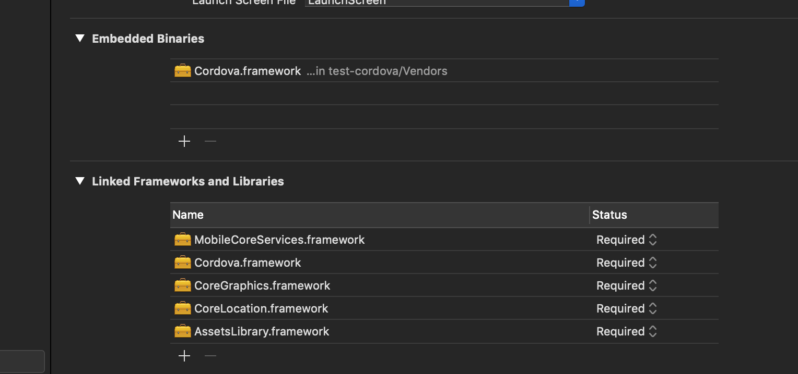

# Cordova-iOS

An xcode project to generate Cordova.framework.

## Usage

1. run this project to generate Corodva.framework.
2. copy this framework to your native project and embed it  

3. Create a folder references called `www` to your native project. Place you web project to this folder.
4. copy `config.xml` to your native project

